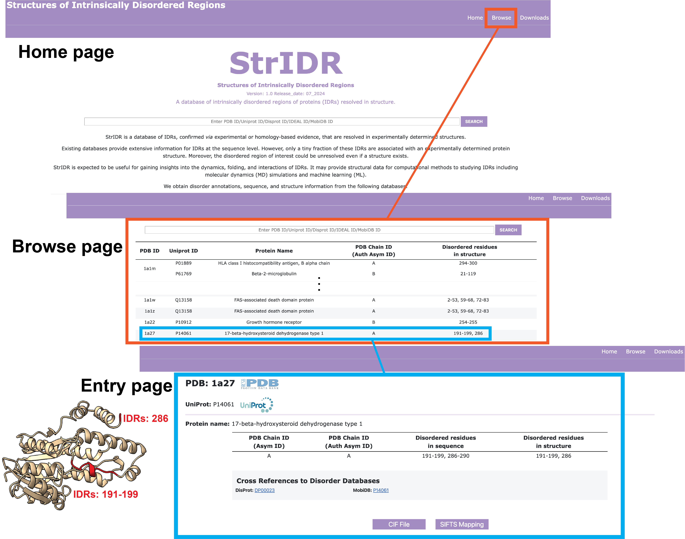

# StrIDR: Structures of Intrinsically Disordered Regions

StrIDR is a database of IDRs, confirmed via experimental or homology-based evidence, that are resolved in experimentally determined structures.  
Existing databases provide extensive information for IDRs at the sequence level. However, only a tiny fraction of these IDRs are associated with an experimentally determined protein structure. Moreover, the disordered region of interest could be unresolved even if a structure exists.  
StrIDR is expected to be useful for gaining insights into the dynamics, folding, and interactions of IDRs. It may provide structural data for computational methods to studying IDRs including molecular dynamics (MD) simulations and machine learning (ML).  



## Publication and Website
Kartik Majila, Shruthi Viswanath, __StrIDR: a database of intrinsically disordered regions of proteins with experimentally resolved structures.__, at DOI: []().

StrIDR webserver: https://isblab.ncbs.res.in/stridr

## Dependencies:
* See `requirements.txt` for Python dependencies


## Directory structure
1. [Database](Database/) : contains the input files for database creation and the database.
2. [scripts](scripts/) : contains all the scripts used for creation of the database.


## Creating StrIDR
### Obtain data files from disorder databases and datasets
| IDR Databases        | Download URL                                 | File Format | Date of Access |
| -------------------- | -----------                                  | ----------- | -------------- |
| DIBS                 | https://dibs.enzim.ttk.mta.hu/downloads.php  | XML         | 19 Jul, 2024   |
| MFIB                 | https://mfib.pbrg.hu/downloads.php           | XML         | 19 Jul, 2024   |
| FuzDB                | https://fuzdb.org/browse/                    | TSV         | 19 Jul, 2024   |
| DisProt              | https://disprot.org/download                 | TSV         | 19 Jul, 2024   |
| IDEAL                | https://www.ideal-db.org/download/archive/   | XML         | 19 Jul, 2024   |
| IDEAL                | https://mobidb.bio.unipd.it/#/swagger        | used API    | 19 Jul, 2024   |
| PDBtot and PDBcdr    | https://doi.org/10.1016/j.jmb.2020.02.017    | XLSX        | 19 Jul, 2024   |

MobiDB entries are downloaded using the MobiDB API.  

Add the downloaded data files to the `./Database/raw/` directory. The file names must match those specified in `1_download_databases.py`.

### Creating input files for StrIDR construction
```
python 1_download_databases.py -c CORES
```
CORES - number of cores to parallelize on (we used 10).
This script generates the following files that are used by the downstream script:  
1. [Merged_Uniprot_IDs.txt](./Database/Merged_Uniprot_IDs.txt) : file containing UniProt accessions obtained from the aforementioned databases and datasets.
2. [Merged_PDB_IDs.txt](./Database/Merged_PDB_IDs.txt) : txt file containing PDB IDs for all UniProt accessions.


### Creating StrIDR database
```
python 2_create_database_dataset_files.py -c CORES
```
CORES - number of cores to parallelize on (we used 200).

### Move files to the website directory
```
python move_to_web_dir.py
```

### Note
Please check network connectivity before running the scripts or use lesser CORES in case of a high server request failure.


### Populate the SQL database and make migrations

```
cd ../website/dbsite/
python populate.py
python manage.py migrate
python manage.py makemigrations database
python manage.py migrate
```

## Information
__Author(s):__ Kartik Majila, Shruthi Viswanath

__Date__: August 22, 2023

__License:__ [CC BY-SA 4.0](https://creativecommons.org/licenses/by-sa/4.0/)
This work is licensed under a Creative Commons Attribution-NonCommercial-ShareAlike 4.0 International License.


__Parallelizeable:__ Yes

__Publications:__  Majila, K. and Viswanath S. StrIDR: a database of intrinsically disordered regions of proteins with experimentally resolved structures. DOI: []().
